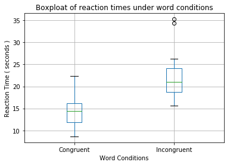
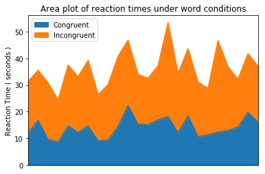

# Background Information

In a Stroop task, participants are presented with a list of words, with each word displayed in a color of ink. The participant’s task is to say out loud the color of the ink in which the word is printed. The task has two conditions: a congruent words condition, and an incongruent words condition. In the congruent words condition, the words being displayed are color words whose names match the colors in which they are printed: for example RED, BLUE. In the incongruent words condition, the words displayed are color words whose names do not match the colors in which they are printed: for example PURPLE, ORANGE. In each case, we measure the time it takes to name the ink colors in equally-sized lists. Each participant will go through and record a time from each condition.

# Questions For Investigation

### 1. What is our independent variable? What is our dependent variable?

* The independent variables are two conditions, congruent words condition and an incongruent words condition since these condition are fix before experiment.

* The dependent variable is the reaction time which may vary depending upon the dependent variable.

### 2. What is an appropriate set of hypotheses for this task? What kind of statistical test do you expect to perform? 

Here we need to test the existance of Stoop effect which is, the reaction time is more under incongruent words condition compare to reaction time under congruent words condition.

So we can compare the **mean reaction time** for both the populations mainly congruent and incongruent and if the significant difference is found then we can assert that the stroop effect is existing.

### Type of statistical test

Clearly we have to compare values for each sample under two different conditions. As we are using pairs of related dataset, ** Paired t-test ** can be used.

### Set of hypotheses
* ** H<sub>0</sub> (Null Hypothesis) **(No significant difference): μ <sub>cogruent</sub> − μ <sub>incogruent</sub> = 0 
* ** H<sub>a</sub> (Alternate Hypothesis) ** (Significant difference): μ <sub>cogruent</sub> − μ <sub>incogruent</sub> != 0 


### 3. Report some descriptive statistics regarding this dataset. Include at least one measure of central tendency and at least one measure of variability.
 


```python
###  Import useful libraries for descriptive statistics
import pandas as pd
import numpy as np
import matplotlib.pyplot as plt
from scipy import stats


###  Loading dataset from csv file
data_set = pd.read_csv('data.csv')
n_samples = data_set.shape[0]
print("Dataset has {} samples.".format(n_samples))
data_set.head()

```

    Dataset has 24 samples.


<table border="1" class="dataframe">
  <thead>
    <tr style="text-align: right;">
      <th></th>
      <th>Congruent</th>
      <th>Incongruent</th>
    </tr>
  </thead>
  <tbody>
    <tr>
      <th>0</th>
      <td>12.079</td>
      <td>19.278</td>
    </tr>
    <tr>
      <th>1</th>
      <td>16.791</td>
      <td>18.741</td>
    </tr>
    <tr>
      <th>2</th>
      <td>9.564</td>
      <td>21.214</td>
    </tr>
    <tr>
      <th>3</th>
      <td>8.630</td>
      <td>15.687</td>
    </tr>
    <tr>
      <th>4</th>
      <td>14.669</td>
      <td>22.803</td>
    </tr>
  </tbody>
</table>


We can use mean time as a measure of central tendancy and standard deviation as measure of variability for both the populations.


```python
###  Calculating the sample mean for congruent and incongruent condition.
mu_congruent = np.round( np.mean( data_set.Congruent ), decimals=4 )
mu_incongruent = np.round( np.mean( data_set.Incongruent ), decimals=4 )

###  Calculating the sample standard deviation for congruent and incongruent condition.
ssdv_congruent = np.round( np.std( data_set.Congruent , ddof=1), decimals=4 )
ssdv_incongruent = np.round( np.std( data_set.Incongruent , ddof=1), decimals=4 )

print("Congruent condition -->  mean: {} and sample SDV: {}\n".format(mu_congruent,ssdv_congruent))
print("Incongruent condition -->  mean: {} and sample SDV: {}\n".format(mu_incongruent,ssdv_incongruent))
```

    Congruent condition -->  mean: 14.0511 and sample SDV: 3.5594
    
    Incongruent condition -->  mean: 22.0159 and sample SDV: 4.7971
    


Clearly we can get the idea of reaction times from the means of two groups. Under the influence of Incongruent condition, reaction time increases. For graphical visualisation you can check answer to next question. 

### 4. Provide one or two visualizations that show the distribution of the sample data. Write one or two sentences noting what you observe about the plot or plots.


```python
### Boxplot representation of reaction times.

data_set.boxplot()
plt.xlabel("Word Conditions")
plt.ylabel("Reaction Time ( seconds )")
plt.title('Boxploat of reaction times under word conditions')
plt.show()
```





```python
### Area plot of reaction times.

data_set.plot.area(stacked=True,x=None)
plt.tick_params( bottom='off' , labelbottom='off')
plt.ylabel("Reaction Time ( seconds )")
plt.title('Area plot of reaction times under word conditions')
plt.show()
```





### Observations

* From the box plot we can infer that, the median of reaction times for congruent sample is lower than the incongruent. The mean reaction time is also lower under congruent condition. 

* As seen in area plot, almost each of the participant has taken more reaction time when the incongruent condition is applied.

### 5. Now, perform the statistical test and report your results. What is your confidence level and your critical statistic value? Do you reject the null hypothesis or fail to reject it? Come to a conclusion in terms of the experiment task. Did the results match up with your expectations?

To compare the means of the two paired sets of data, the differences between all pairs must be, first, calculated.

Let ``diff`` represents the differences between all pairs. The average of the difference ``diff`` is compared to 0. If there is any significant difference between the two pairs of samples, then the mean of ``diff`` is expected to be far from 0.


```python
### Calculating diff, mean of diff and std of diff
diff = np.subtract(data_set.Congruent,data_set.Incongruent)
diff_mean = np.mean(diff)
diff_sdv = np.std(diff, ddof=1)
print("Mean Difference : ", diff_mean)


### T-value Estimation
X_Bar = 0
diff_SE = diff_sdv / np.sqrt(n_samples)
t_value = ( diff_mean ) / diff_SE
print("T value : ", t_value)

### critical value for alpha = 0.05 and df = 23 is 2.069
c_value = stats.t.ppf(0.975,n_samples-1)
print("Critical value for alpha ( 0.05 ) : ", c_value)

### P-Value Estimation
p_value = stats.t.sf(np.abs(t_value), n_samples-1)*2
print("P value : ", p_value)

### P-Value Estimation
p_value_lower = diff_mean + c_value*diff_SE
p_value_upper = diff_mean - c_value*diff_SE
print("Confidence interval : [{} , {}]".format(p_value_lower,p_value_upper))
```

    Mean Difference :  -7.964791666666667
    T value :  -8.02070694411
    Critical value for alpha ( 0.05 ) :  2.06865761042
    P value :  4.10300058571e-08
    Confidence interval : [-5.910555423968423 , -10.019027909364912]


### Conclusion

*  P value is nearly **0** which is less than significance level of **0.05** so we can reject the  null hypothesis can reject the null hypothesis and conclude that there exist a stroop effect with a significant difference in congruent and incongruent word condition reaction times.

* From Confidence Interval we are 95% confident that the difference in congruent and incongrent reaction time is between -5.91 s to -10.019 s. 

### 6. What do you think is responsible for the effects observed? Can you think of an alternative or similar task that would result in a similar effect? Some research about the problem will be helpful for thinking about these two questions!

1. One possible explanation to stroop effect is the processing speed of our mind. Word reading is faster than color naming, so color naming simply does not have the opportunity to interfere with word reading.

2. Similar experiment I found after research is **"Interactive "Number Stroop" Effect Experiment"**. Here we are suppose to say the count of words in each box. Experiment has two sets. In first set, boxes contain the names of animals for e.g "DOG","CAT". In second set boxes contain numbers written in words "ONE", "TWO". It was easy in first set to say the count. The reaction time is high in second set. 

### References

1. STHDA : http://www.sthda.com/english/wiki/t-test-formula
2. Learning and Automaticity: A Connectionist Explanation of the Stroop Effect: http://staff.itee.uq.edu.au/janetw/cmc/chapters/Stroop/
3. Interactive "Number Stroop" Effect Experiment : https://faculty.washington.edu/chudler/java/readyn.html
